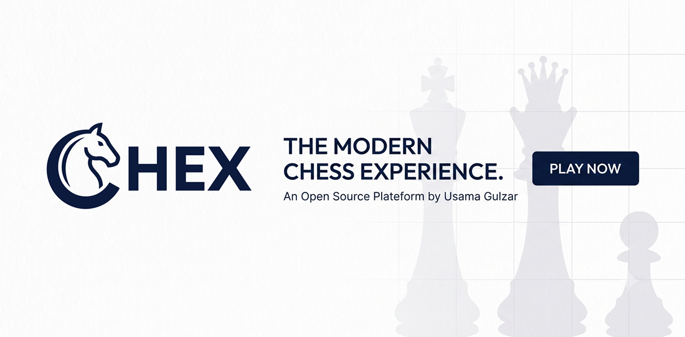

<div align="center">

# ♟️ Chex — Beyond 64 Squares

**A modern, installable chess experience with offline play, real‑time multiplayer, engine analysis, and six built‑in variants.**

[](LICENSE)
[](#-progressive-web-app)
[](#-tech-stack)
[](#-analysis--engine)

[Live Demo](https://usamagulzar.github.io/chex/) · [Report a Bug](https://github.com/usamagulzar/chex/issues) · [Request a Feature](https://github.com/usamagulzar/chex/issues)



</div>

---

## 📋 Table of Contents

- [About](#-about)
- [Features](#-features)
- [Game Variants](#-game-variants)
  - [Chess960 (Fischer Random)](#1-chess960-fischer-random)
  - [Dice Chess](#2-dice-chess)
  - [Fog of War](#3-fog-of-war)
  - [Draft Mode (Salary Cap)](#4-draft-mode-salary-cap)
  - [Identity Theft](#5-identity-theft)
  - [Hand and Brain](#6-hand-and-brain)
  - [Combining Variants](#combining-variants)
- [Analysis & Engine](#-analysis--engine)
- [Multiplayer](#-multiplayer)
- [Progressive Web App](#-progressive-web-app)
- [Tech Stack](#-tech-stack)
- [Project Structure](#-project-structure)
- [Getting Started](#-getting-started)
- [Configuration](#-configuration)
- [Roadmap](#-roadmap)
- [Contributing](#-contributing)
- [Acknowledgments](#-acknowledgments)
- [License](#-license)

---

## 📖 About

**Chex** is a self‑contained, dependency‑light chess platform built with vanilla HTML, CSS, and JavaScript. It runs entirely in the browser, installs as a native‑feeling app on desktop and mobile (PWA), and works fully offline once cached — while still supporting real‑time online multiplayer, move‑by‑move engine analysis, and a suite of custom chess variants layered cleanly on top of the standard rules engine.

There is no build step, no bundler, and no framework. The entire client ships as static assets, making it trivial to fork, self‑host, or extend.

## ✨ Features

| Category | Highlights |
|---|---|
| **Core Gameplay** | Full legal‑move chess engine (castling, en passant, promotion, check/checkmate/stalemate, threefold repetition, 50‑move rule, insufficient material) |
| **Offline Play** | Local pass‑and‑play on a single device, with a dedicated offline fallback page and full asset caching via a Service Worker |
| **Online Multiplayer** | Real‑time challenge → accept → play flow over Firebase, with move sync, resign/draw offers, disconnect handling, and reconnect grace periods |
| **Analysis** | Post‑game and live evaluation using an embedded Stockfish 18 (Lite) WebAssembly engine — evaluation bar, best‑move suggestions, move classification |
| **Game History** | Full move list, PGN generation with variant tagging, and a review mode to step back through any completed or in‑progress game |
| **Clocks & Timers** | Configurable time controls with per‑player clocks |
| **Sound & Visuals** | Move/capture/check audio cues, custom SVG piece sets, animated arrows, and a fully responsive board that scales to any viewport |
| **Theming** | Multiple built‑in themes — Dark · Blue, Dark · Pink, Light · Blue, Light · Pink — switchable at runtime and persisted locally |
| **Accounts** | Lightweight username‑based identity with anonymous Firebase authentication — no passwords, no friction |
| **Installable** | Full Progressive Web App support: manifest, icons for every platform, maskable icons, and app shortcuts |
| **Six Game Variants** | Chess960, Dice Chess, Fog of War, Draft Mode, Identity Theft, and Hand and Brain — independently toggleable and, in most combinations, stackable |

## 🎲 Game Variants

Chex extends the standard rules engine with a dedicated variants module (`js/variants.js`). Every variant can be enabled from the setup/settings screen before a game begins, for both offline and online play. Below is the complete, authoritative rule set for each.

### 1. Chess960 (Fischer Random)

The classic Bobby Fischer–devised variant, implemented to the official FIDE specification.

**Setup rules:**
- Both back ranks are randomized using an identical, mirrored layout — White and Black start with the same piece arrangement, exactly as in standard chess.
- The two bishops are always placed on opposite‑colored squares (one on an even file, one on an odd file).
- The king is always placed strictly between the two rooks.
- The queen and knights fill the remaining squares at random.
- All 960 possible legal starting positions are reachable, including the standard chess starting position itself.

**Gameplay rules:**
- All standard chess rules apply once the position is set, including Chess960‑style castling (the king and rook move to their standard castled squares, regardless of their starting files).
- Engine evaluation and best‑move suggestions are automatically disabled for Chess960 games to preserve the spirit of the variant.

### 2. Dice Chess

A luck‑infused variant where the pieces you're allowed to move each turn are constrained by a dice roll.

**Rules:**
- At the start of every turn, the active player "rolls" and is restricted to moving only the piece types shown by the roll.
- If a player has three or fewer distinct movable piece types (or only two or fewer pieces remain on the board), **all** of their movable types become available — this prevents the variant from producing unwinnable, move‑less positions in the endgame.
- Otherwise, exactly **two** piece types are randomly selected from the set of types that currently have at least one legal move.
- The king can only be moved (including castling) when it is one of the rolled types.
- If a player is in check, the roll still restricts *which pieces* may move — but only moves that resolve check remain legal, per standard rules.
- In online games, only the player whose turn it is computes the roll; the result is synced to their opponent in real time so both clients always agree on the legal move set.

### 3. Fog of War

A variant of imperfect information: you can only see what your pieces can currently see.

**Rules:**
- Each player's view of the board is limited to squares that are visible to at least one of their own pieces (i.e., squares they could legally move to or currently attack/defend, plus their own occupied squares).
- Enemy pieces outside your vision are hidden from view entirely — you play against an incomplete picture of the board.
- Because full information about check is not available to either player, **check and checkmate are not enforced** while fog is active; the game instead ends when a king is actually captured.
- The engine evaluation bar and best‑move overlay are disabled, since neither reflects the information asymmetry of the position.
- Fog lifts completely once the game ends, so the full final position is always visible in review.

### 4. Draft Mode (Salary Cap)

Also known as "The Draft" — instead of the standard starting position, each player builds their own army under a shared points budget.

**Rules:**
- Both players start with an empty board and a budget of **39 points** (configurable via `DRAFT_BUDGET`).
- Piece costs follow standard relative chess values:

  | Piece | Cost |
  |---|---|
  | Pawn | 1 |
  | Knight | 3 |
  | Bishop | 3 |
  | Rook | 5 |
  | Queen | 9 |
  | King | 0 (free, and mandatory) |

- Each player may only place pieces on their own half of the board — the four ranks closest to them.
- A player must place **exactly one King** before they are allowed to lock in their draft; kings cannot be duplicated, and placing a new king removes any previously placed king for that color.
- Clicking an already‑placed piece of your own removes it from the board and refunds its point cost, allowing you to freely reallocate your budget until you lock in.
- Opponent placements are hidden from view during the drafting phase — each side drafts their army in secret.
- Once both players lock in their draft, the drafting phase ends permanently for that game and standard play begins (with any other enabled variants — Dice Chess, Hand and Brain, etc. — activating from that point on).

### 5. Identity Theft

Capturing a piece grants the capturing piece some or all of the captured piece's movement powers, in one of two modes:

**Steal mode:**
- When a piece captures an enemy piece, the attacker **fully transforms** into the captured piece's type, inheriting its exact movement rules going forward.
- The King is exempt — kings never steal an identity and always retain their royal, single‑square movement and status.

**Append mode:**
- When a piece captures an enemy piece, the attacker **adds** the captured piece's movement type(s) to its own repertoire rather than replacing them, allowing a single piece to accumulate multiple movement patterns over the course of a game.
- Redundant powers are automatically pruned: since a Queen's movement already covers a Bishop's, a Rook's, and a Pawn's directional capabilities, holding "Queen" on a piece makes those specific types redundant and they are dropped from its type list.
- A piece's displayed/base type is always its single most valuable retained power, with all accumulated types sorted by point value.
- The King is exempt from this mode as well, and never accumulates additional powers.

In both modes, the eval bar and best‑move overlay are disabled, since standard engine evaluation cannot account for morphed piece identities.

### 6. Hand and Brain

A cooperative‑against‑the‑clock variant traditionally played in pairs; Chex implements the "Brain" role as an automated assistant.

**Rules:**
- On each turn, an assistant engine ("the Brain") analyzes the position and suggests **one piece type** — not a specific move — that the active player ("the Hand") must move somewhere legally that turn.
- The player retains full freedom to choose *which* specific piece of the suggested type to move, and *where* to move it — only the type is constrained.
- If it is the opponent's turn in an online game, the suggestion is computed locally by whichever client owns that turn and then synced, so both players always see an identical suggestion.
- While a suggestion is pending, the UI displays a "Thinking…" state until it resolves.

### Combining Variants

Most variants are designed to compose. For example, **Draft Mode + Dice Chess** is fully supported: the drafting phase takes priority and suspends Dice Chess, Hand and Brain, Fog of War, and Identity Theft until both players lock in, after which normal variant interactions resume for the rest of the game. **Chess960** is generally best played on its own, since it disables engine assistance and is not designed to interact with piece‑identity or visibility variants. Enabled variants are recorded as PGN header tags (`[Variant "..."]`) so completed games retain a full record of the ruleset they were played under.

## 🧠 Analysis & Engine

Chex embeds **Stockfish 18 (Lite, single‑threaded WebAssembly build)** directly in the client for:

- Live position evaluation, rendered as a vertical eval bar alongside the board.
- Best‑move suggestions during review.
- All analysis runs **entirely client‑side** — no server round‑trip, no API key, and full functionality offline once the engine's `.wasm` binary is cached by the Service Worker.

Engine features are automatically hidden for variants where a standard evaluation would be misleading or would break the format (Chess960, Fog of War, Identity Theft).

## 🌐 Multiplayer

Real‑time online play is powered by **Firebase**:

- **Cloud Firestore** — challenge creation/acceptance and lobby state.
- **Realtime Database** — live game state, moves, clocks, dice rolls, brain suggestions, and draft placements, synced with millisecond‑level latency.
- **Firebase Authentication** — anonymous sign‑in paired with a locally chosen username, so there's no account creation friction.

The multiplayer layer includes heartbeat‑based presence detection, a disconnect grace period before a game is forfeited, and automatic cleanup of stale challenges and finished games.

## 📱 Progressive Web App

Chex is a fully spec‑compliant PWA:

- **Installable** on desktop, Android, and iOS with a complete icon set (16px through 512px, plus maskable variants).
- **Offline‑first caching** via a versioned Service Worker (`sw.js`): the app shell, styles, scripts, and the Stockfish engine binary are precached, static assets are served cache‑first with background revalidation, and navigations fall back gracefully to a dedicated `offline.html` page when neither the network nor the cache has what's needed.
- **App shortcuts** for jumping straight into an offline or online game from the OS‑level app icon.
- Live multiplayer traffic (Firestore/RTDB/Auth) is explicitly excluded from caching so game state is never served stale.

## 🛠 Tech Stack

| Layer | Technology |
|---|---|
| UI | Vanilla HTML5, CSS3 (custom properties/theming), JavaScript (ES6+) |
| Chess Engine (rules) | Custom hand‑written legal‑move engine (`js/engine.js`) |
| Chess Engine (analysis) | Stockfish 18 Lite, compiled to single‑threaded WebAssembly |
| Realtime Backend | Firebase (Authentication, Firestore, Realtime Database) |
| Offline Support | Service Worker + Web App Manifest (PWA) |
| Local Dev Server | Python (`server.py`, `http.server`) |
| Rendering | Inline SVG piece sets and board overlays (`js/svg.js`) |

No build tools, package manager, or transpilation step are required — the project runs directly from static files.

## 📁 Project Structure

```text
chex/
├── css/
│   └── style.css              # All application styling, theming, responsive layout
├── fonts.css                  # Self-hosted font declarations
├── icons/                     # Full PWA icon set (16px–512px, incl. maskable)
├── js/
│   ├── analysis.js            # Post-game analysis, evaluation history
│   ├── app.js                 # Application state machine & orchestration
│   ├── audio.js                # Sound effects
│   ├── auth.js                # Firebase auth & username identity
│   ├── engine.js               # Core legal-move chess engine + Chess960 setup
│   ├── history.js              # Move history & PGN generation
│   ├── multiplayer.js          # Real-time Firebase multiplayer layer
│   ├── stockfish-18-lite-single.js   # Stockfish engine (WASM loader)
│   ├── stockfish-18-lite-single.wasm # Stockfish engine binary
│   ├── svg.js                  # SVG piece/board rendering
│   ├── timer.js                # Game clocks / time controls
│   ├── ui.js                    # DOM/UI glue and interaction handling
│   └── variants.js              # All six game variants (see above)
├── index.html                  # Application entry point
├── manifest.json                # PWA manifest
├── offline.html                 # Offline fallback page
├── preview.png                  # Social/README preview image
├── server.py                    # Minimal local static file server
└── sw.js                        # Service Worker (offline caching)
```

## 🚀 Getting Started

### Prerequisites

- A modern browser (Chrome, Edge, Firefox, or Safari — latest two versions recommended).
- Python 3 (only if you want to run the included local server; any static file server works).

### Clone & Run

```bash
# 1. Clone the repository
git clone https://github.com/usamagulzar/chex.git
cd chex

# 2. Serve it locally (any static server works — one is included)
python3 server.py
# Chex will be available at http://localhost:8000
```

> **Why a server and not just opening `index.html` directly?** The Service Worker, the WebAssembly engine, and ES module‑style fetches all require the app to be served over `http(s)://` rather than the `file://` protocol.

### Playing Offline

Select **Play Offline** from the setup screen (or the app shortcut, once installed) for local pass‑and‑play on one device — no account or network connection required.

### Playing Online

1. Choose a username on first launch (stored locally, backed by anonymous Firebase auth).
2. Select **Play Online**, then challenge a friend by username.
3. Once they accept, the game begins in real time with synced clocks, moves, and any variants you both agreed on.

## ⚙️ Configuration

Chex is designed to be forked and self‑hosted with your own backend:

1. Create a [Firebase](https://firebase.google.com/) project with **Authentication** (Anonymous provider), **Firestore**, and **Realtime Database** enabled.
2. Replace the `firebaseConfig` object at the top of `js/auth.js` with your own project credentials.
3. Update `manifest.json` (`start_url`, `scope`, `id`) and the canonical URLs in `index.html`'s meta tags if you are hosting under a different path than `/chex/`.
4. Bump `CACHE_VERSION` in `sw.js` on every deploy that changes cached files, so returning users pick up the update.

## 🗺 Roadmap

- [ ] Puzzle / tactics trainer mode
- [ ] Persistent game history and player statistics
- [ ] Spectator mode for in‑progress online games
- [ ] Additional variants (e.g., King of the Hill, Atomic)
- [ ] Localization / multi‑language support

Have an idea? Open an [issue](https://github.com/usamagulzar/chex/issues) or start a discussion.

## 🤝 Contributing

Contributions are welcome and appreciated. Please read [`CONTRIBUTING.md`](CONTRIBUTING.md) for coding conventions, the branching model, and how to submit a pull request. All participants are expected to follow the [`CODE_OF_CONDUCT.md`](CODE_OF_CONDUCT.md).

## 🙏 Acknowledgments

- **[Stockfish](https://stockfishchess.org/)** — the open‑source chess engine powering all analysis features.
- **[Firebase](https://firebase.google.com/)** — real‑time backend infrastructure for multiplayer and authentication.
- **Special thanks to Muhammad Faizan Ali** *(BSCS @ SEECS, Class of '29)* — for invaluable thought partnership and contributions throughout the development of this project.

## 📄 License

This project is licensed under the **MIT License** — see [`LICENSE`](LICENSE) for the full text.

---

<div align="center">

Made with ♟️ by [Usama Gulzar](https://github.com/usamagulzar)

</div>
